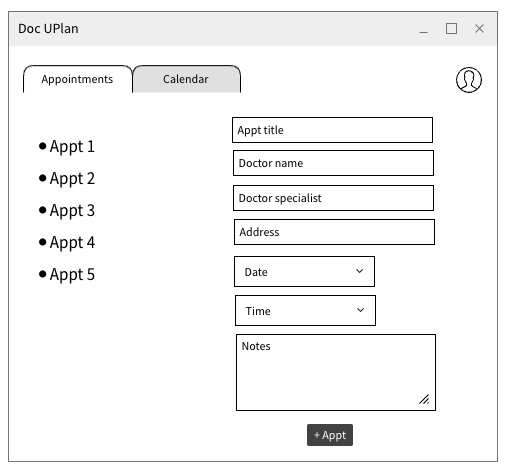
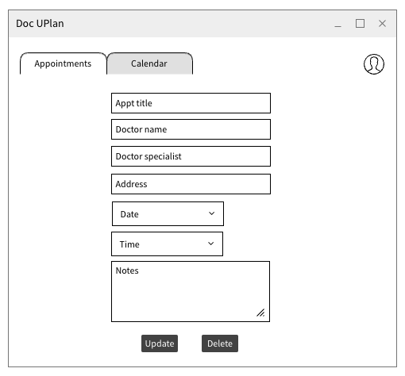
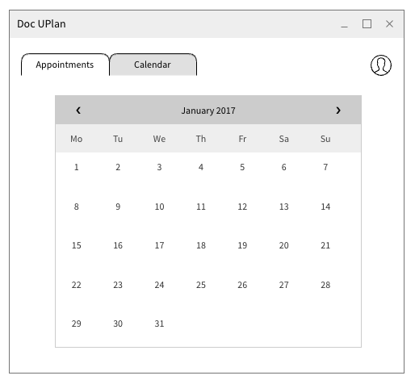
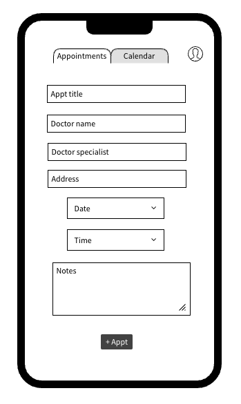

# Doc UPlan -Frontend
**Project By:** Susie Gordon

## Description
Doc UPlan is a full CRUD app developed with Vue and Django that compiles all doctors appointments (family, dentist, optometrist, specialist, etc.) into a calendar to improve time management, organization, and lifestyle. Users can view a list of various appointments and the calendar month of choice displaying all past and future appointments. 

## Links
- [**Github**](LINK)
- [**Deployment**](https://github.com/choisus08/docuplan_frontend)
- [**Trello**](https://trello.com/b/v5jUhSlv/doc-uplan)
 

## Technologies Used
- Django
- Google Fonts
- JavaScript
- Lottie Files
- Node
- PostgreSQL
- Postman
- Python
- Vue 

## Approach
My initial approach was to make a call to the backend by successfully implementing an 'appointment' model with full CRUD capabilities. In order to fully render the CRUD functionalities, the backend url was imported to make the proper requests to load relevant data and initiate corresponding functions...

## Installation
- `Fork` and `clone` this respository
- `cd` into the directory on your local machine
- Open this repository in your code editor and run the code `npm run dev` to open the React app in your browser

## Mockup of UI  
Desktop View  
 

 
Mobile View  

 

## Issues 
1.
2.
3.

## Future Enhancements

## Resources 
